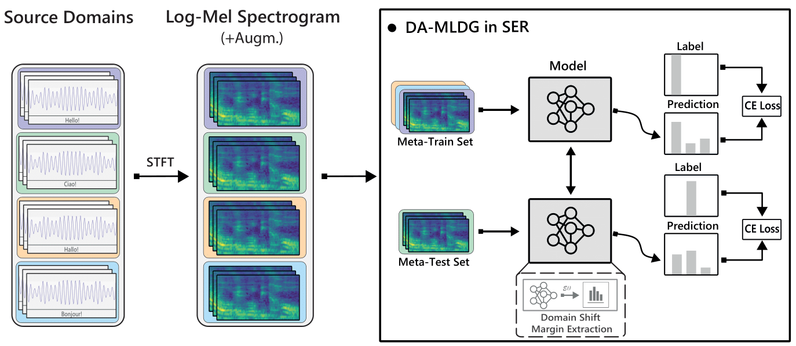

# DA_MLDG: Domain-shift Aware Meta-Learning for Domain Generalization in SER

Domain generalization in the field of audio, especially SER, is still under development. In this work, we study the efficacy of meta learning in SER, and propose DA-MLDG to improve models' generalizability in unseen data. While DA-MLDG demonstrates an improvement over the considered baselines, the resulting models' performance is insufficient to be practical. Through our experimentation, we identified a number of pitfalls that contribute to poor generalization capacity of models, namely, the lack of distinct features in input representations from log-mel spectrograms, and the absence of large-scale in-the-wild SER datasets with rich speech patterns and emotions classes. From these pitfalls, future directions for development of adequate model inputs with plentiful distinguishable representations could greatly advance DG in SER. However, for such an direction to materialize, compiling large-scale amounts of speech emotion data becomes a necessity. Here, providing annotations based on arousal and valence values rather than emotional classes could enable better differentiation between emotions.

	
 <b>Overview of DA-MLDG in SER </b>

	

## <a name="reference"/>Reference</a>

If you use this repository, please consider citing:

<pre>@INPROCEEDINGS{10.1109/PerComWorkshops53856.2022.9767445,
 author={King Gandhi, Raeshak, and Tsouvalas, Vasileios and Meratnia, Nirvana},
 booktitle = {2023 IEEE International Conference on Pervasive Computing and Communications Workshops and other Affiliated Events (PerCom Workshops)},
 title={On applicability of Meta-Learning to Speech Emotion Recognition},
 year = {2023},
 month = {mar}
 pages = {359-364},
 doi = {10.1109/PerComWorkshops53856.2022.9767445},
 url = {https://doi.ieeecomputersociety.org/10.1109/PerComWorkshops53856.2022.9767445},
}</pre>